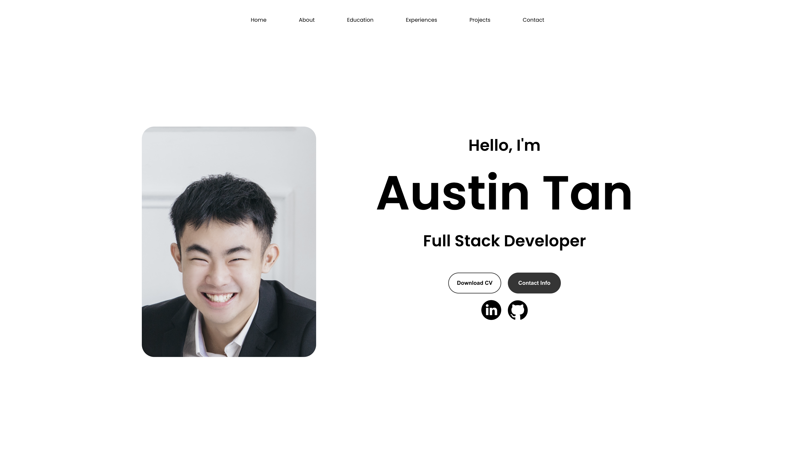

# Personal Portfolio Website



This project is a sleek and responsive Personal Portfolio Website built using HTML, CSS, React.js, and related packages. It aims to deliver a dynamic user experience characterized by fluid navigation and content presentation.

## Features

- **Responsive Design**: The website is fully responsive, adapting seamlessly to varying tablet screen sizes and resolutions.
  
- **Dynamic User Experience**: Users can navigate through the website smoothly, with interactive elements enhancing the overall experience.
  
- **Integration of Animations**: Animations are incorporated throughout the interface to infuse dynamism and interactivity, adding to the overall aesthetic appeal.

## Usage

To view the website, simply visit [https://austintanjunheng.netlify.app/](https://austintanjunheng.netlify.app/).

## Technologies Used

- HTML
- CSS
- React.js

## Installation

If you want to run this project locally, follow these steps:

1. Clone this repository:

   ```
   git clone https://github.com/your-username/your-repository.git
   ```

2. Navigate to the project directory:

   ```
   cd your-repository
   ```

3. Install dependencies:

   ```
   npm install
   ```

4. Start the development server:

   ```
   npm start
   ```

5. Open your browser and visit `http://localhost:3000` to view the website locally.
